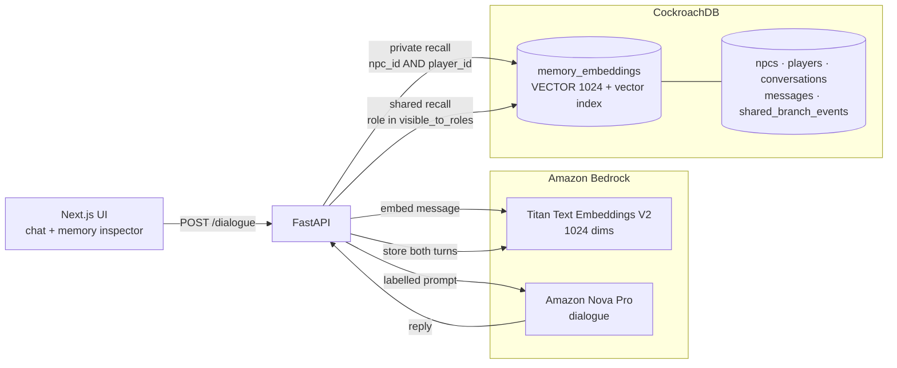

# OmniNPC

**Rishi Chhabra · Aryan Kandari**

Role-aware semantic memory for AI characters, built on CockroachDB and Amazon Bedrock.

An agent that remembers everything it was ever told is not a memory system. It is a leak
waiting for the right question.

OmniNPC gives each character its own memory and enforces who may recall what **in the
database query**, not in the prompt. A private conversation with the branch manager stays
private. The decision that came out of it can be published to the roles that need it. The
teller can retrieve neither.

## Why this is hard

Most character systems either forget earlier interactions or pour all history into one
shared context. A shared context makes it trivial for a character to reveal something it
should never have received, and asking the model nicely not to mention it is not an access
control boundary.

OmniNPC applies the visibility rule during retrieval:

- **Private memories** carry an NPC id and a player id. Recall requires both to match, so
  there is no database path from one character to another's rows.
- **Shared branch events** have no NPC owner. Their audience is derived from the event
  type on the server, and matched against the requesting character's role.
- **The prompt labels provenance**, separating what a character personally remembers from
  official branch bulletins, so retrieved facts carry the right authority.

This design prevents another NPC's private rows from entering the recall context. It
does not attempt to treat model instructions as an access-control boundary.

## Scenario guides

- [Comprehensive bank branch scenario](docs/SCENARIO.md) describes the intended
  end-to-end experience and marks the implementation status of every stage.

## Architecture

A dialogue request:

1. Embed the player's message with Titan.
2. Retrieve private memories for this character and this player, above a similarity floor.
3. Retrieve shared events whose audience includes this character's role.
4. Compose a prompt that labels the two kinds separately.
5. Generate the reply with Nova.
6. Store both sides of the exchange as private memories for that character.

Structured records and 1024-dimensional memory vectors live in the same CockroachDB
cluster, so a visibility rule is a `WHERE` clause rather than a sync job between a database
and a separate vector store.

## Hackathon tool mapping

Built for the [CockroachDB × AWS Hackathon — Build with Agentic Memory](https://cockroachdb-ai.devpost.com/).

| Tool | Used for | Where |
|---|---|---|
| CockroachDB Distributed Vector Indexing | `VECTOR(1024)` column and vector index over all character memory; similarity recall | `schema/init.sql`, `backend/app/memory/retrieval.py` |
| CockroachDB ccloud CLI | Provisioning the `omninpc` database and deriving the connection string, so no host is hardcoded | `scripts/bootstrap.sh` |
| CockroachDB Cloud Managed MCP Server | Read-only auditing of stored memory and branch events. Configured; authentication not yet completed | `.mcp.json` |
| Amazon Bedrock — Titan Text Embeddings V2 | Every memory vector, at 1024 dimensions | `backend/app/providers/bedrock.py`, `backend/app/embeddings.py` |
| Amazon Bedrock — Amazon Nova Pro | Character dialogue, via the Converse API | `backend/app/providers/bedrock.py` |

The cluster runs on AWS `us-east-1`, the same region as the Bedrock calls.

## License

[MIT](LICENSE).
